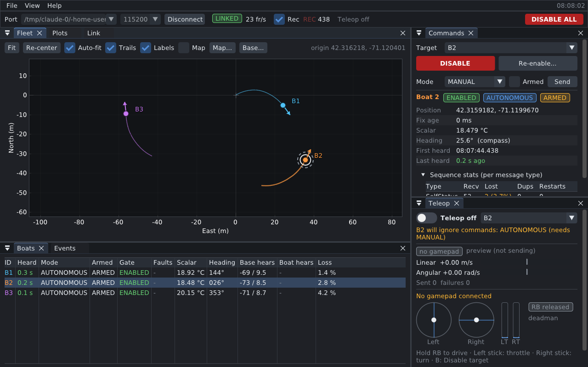

# ASEP Base Station

Ground-station app for the ASEP boat swarm. It runs on a laptop (macOS or
Ubuntu) and talks over USB serial to a **base-station ESP32**. The ESP32
relays [wirelink](https://github.com/spseng/ASEP-boat/tree/main/shared/wirelink)
frames between the laptop and the boats over LoRa. With it you can:

- watch the fleet live: positions and tracks, mode / armed / gate state,
  faults, the scalar value, and link quality in both directions
- teleoperate a boat with an **Xbox controller** (deadman button, rate-limited,
  fails to zero)
- send **Disable** / **Re-enable** / **Set mode** to one boat or to all
- record every frame to a session log for later analysis



This repository contains only the laptop side. Firmware and ROS code live
in [ASEP-boat](https://github.com/spseng/ASEP-boat), which is included
read-only as a git submodule for the shared message definitions.

```
 laptop (this app) ──USB serial──> base-station ESP32 ──LoRa──> boats (ESP32 + Pi)
                   <─────────────                    <────────
          wirelink frames, relayed unchanged in both directions
          (+ optional RxInfo / BaseStatus from the base ESP32 itself)
```

---

## Building

You need a C++17 compiler, CMake ≥ 3.22, Ninja (optional) and git. SDL3,
Dear ImGui, ImPlot and Catch2 are downloaded and built automatically the
first time you configure. The first build takes a few minutes, mostly SDL3.

```sh
git clone --recursive https://github.com/spseng/ASEP-boat-base-station.git
cd ASEP-boat-base-station
# already cloned without --recursive?  git submodule update --init

cmake -S . -B build -G Ninja -DCMAKE_BUILD_TYPE=Release
cmake --build build
ctest --test-dir build          # optional: run the tests
```

### macOS

```sh
xcode-select --install           # compiler
brew install cmake ninja
```

### Ubuntu 24.04

SDL3 needs the X11/Wayland development headers to build:

```sh
sudo apt install build-essential cmake ninja-build git \
  libx11-dev libxext-dev libxrandr-dev libxcursor-dev libxfixes-dev libxi-dev \
  libxss-dev libxtst-dev libxkbcommon-dev libwayland-dev wayland-protocols \
  libegl1-mesa-dev libgl1-mesa-dev libdrm-dev libgbm-dev libudev-dev libdbus-1-dev
```

Serial ports need permission: `sudo usermod -aG dialout $USER`, then log
out and back in.

Build options (all ON by default): `-DBASESTATION_BUILD_GUI=OFF` builds only
the core, simulator and tests (no SDL needed), `-DBASESTATION_BUILD_TESTS`,
`-DBASESTATION_BUILD_SIM`.

---

## Running

```sh
./build/src/app/asep_base_station                       # pick the port in the toolbar
./build/src/app/asep_base_station --port /dev/ttyUSB0   # or connect at startup
./build/src/app/asep_base_station --help
```

On macOS the ESP32 appears as `/dev/cu.usbserial-*` or `/dev/cu.usbmodem*`.
On Ubuntu it is `/dev/ttyUSB*` or `/dev/ttyACM*`. The default baud rate is
`boat::serial::BAUD_RATE` (115200) from `boat_defs`.

### Without hardware: the simulator

`asep_fake_base` pretends to be the base-station ESP32 plus a fleet of boats,
on a pseudo-terminal. The boats answer Command, Disable, Re-enable and
SetMode; there is packet loss and the occasional corrupted byte, and a
simulated GPS fault comes and goes.

```sh
./build/src/sim/asep_fake_base              # prints e.g.  PORT /dev/pts/3
./build/src/app/asep_base_station --port /dev/pts/3
```

`--link /tmp/asep-sim` also creates a stable symlink to the port.
`--start-mode auto` starts the boats wandering. `--help` lists every option
(boat count, loss, corruption, rates, origin).

### Session logs

While connected, every frame received and sent is written to
`asep-YYYYmmdd-HHMMSS.aseplog` in the log directory, which can be changed in
the app. `asep_log_dump` turns a log into CSV:

```sh
./build/src/sim/asep_log_dump session.aseplog > session.csv
```

---

## Teleop with an Xbox controller

Plug the controller in over USB, or pair it over Bluetooth, before or after
starting the app. Default mapping (all of it can be changed in the Teleop
panel):

| Control | Action |
|---|---|
| **RB (hold)** | deadman: nothing but zero is sent unless it is held |
| Left stick up/down | forward / reverse speed (`lin_vel`) |
| Right stick left/right | turn (`ang_vel`; right stick right = turn right) |
| **B** | Disable the teleop target |

How it behaves:

- **Enabling:** teleop is off until you tick *Teleop enabled* and pick a
  target boat. While it's on, the app sends a `Command` 10 times a second.
- **When it sends zero:** releasing RB, unplugging the controller, or a UI
  that stops updating (input older than 250 ms) all send zero velocity.
  Commands keep flowing either way, so the boat sees the zero.
- **Switching off:** turning teleop off, changing target, or quitting the
  app first sends a short burst of zero commands to the old target.
- **Background input:** the controller keeps working when the app window is
  not focused. The deadman button still applies.
- **The boat must accept it:** a boat acts on `Command` only in MANUAL mode,
  armed, with its gate enabled. The Teleop panel warns if the target's last
  reported state says it will ignore you.

**Disable** (toolbar *DISABLE ALL*, per-boat *DISABLE*, or B on the
controller) is sent three times, 100 ms apart, because LoRa loses packets. A
Re-enable sent afterwards cancels any repeats still queued for that boat.
Software disable complements the hardware E-stop and battery disconnect;
it does not replace them.

---

## Protocol

Every message is a wirelink frame (`COBS( type | seq | len | payload | CRC16 )`,
0x00-delimited) on every link. The base-station ESP32 relays frames
unchanged, so `seq` numbers belong to the original sender. The app counts
lost packets per boat and per message type from them.

| Type | Message | Direction | Defined in |
|---|---|---|---|
| 0 | `Disable {rx_id}` | land → boat | `src/proto/basestation/proto/lora.h` |
| 1 | `SelfStatus {PeerEntry}` | boat → all | 〃 |
| 2 | `Command {rx_id, lin_vel mm/s, ang_vel mrad/s}` | land → boat | 〃 |
| 3 | `Status {tx_id, mode, armed, gate, faults, heading, gs_rssi, gs_snr}` | boat → land | 〃 |
| 4 | `Reenable {rx_id}` | land → boat | 〃 |
| 5 | `SetMode {rx_id, mode, armed}` | land → boat | 〃 |
| 0x80 | `RxInfo {rssi, snr}` | base ESP32 → PC | `src/proto/basestation/proto/base.h` |
| 0x81 | `BaseStatus {uptime, rx_ok, rx_bad, tx_count}` | base ESP32 → PC | 〃 |

`rx_id` 255 (`boat::ids::BROADCAST_ID`) addresses every boat.

The LoRa message set is a **proposal**. It will move upstream into
`wirelink/msg/lora.h`; until then it lives here. Everything the ASEP-boat
repository needs to change is listed in
**[WIRELINK_CHANGES.md](WIRELINK_CHANGES.md)**.

---

## Project layout

```
src/proto/   message definitions + codec (header-only)
src/core/    everything that is not GUI: serial port, frame splitting,
             link session, session log, fleet model, teleop, commands
src/app/     the SDL3 + Dear ImGui + ImPlot application
src/sim/     asep_fake_base simulator, asep_log_dump
tests/       Catch2 unit + integration tests (pty-backed, no hardware)
external/    ASEP-boat submodule (read-only)
docs/        screenshots
```

The core has no GUI dependency and is covered by the tests, which include
end-to-end runs against the simulator over a real pseudo-terminal. CI builds
and tests on Ubuntu 24.04 and macOS on every push.

## Not yet verified on real hardware

Everything has been tested against the simulator on Linux, and built and
tested in CI on macOS. Still to be checked on the real setup:

- an actual Xbox controller (axis directions, and Bluetooth on macOS)
- the base-station ESP32 firmware, which isn't written yet (see
  WIRELINK_CHANGES.md §3 for what the app expects of it)
- real LoRa loss and RSSI behaviour
